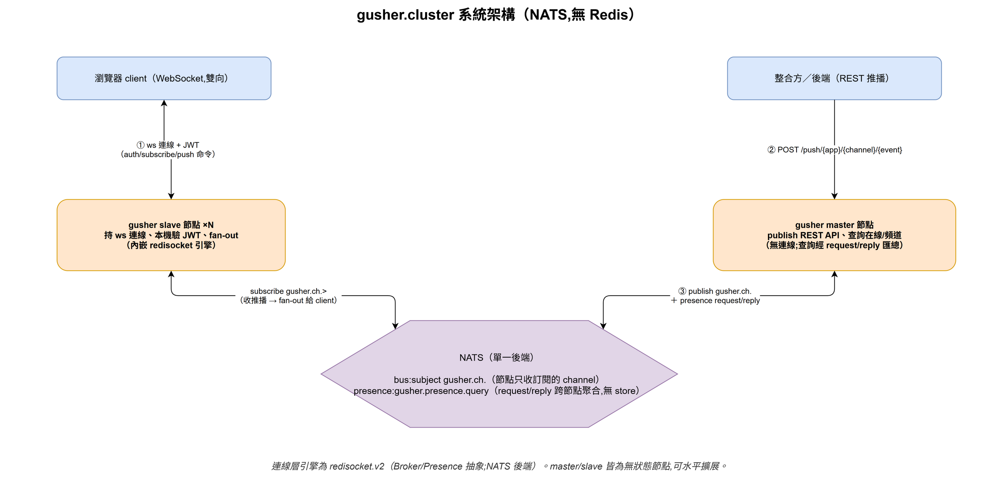
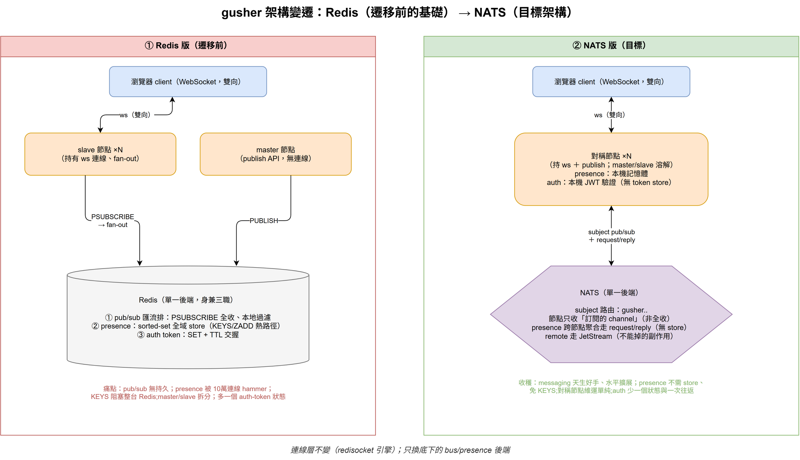

# gusher.cluster architecture (NATS)

> 🌐 **English** · [繁體中文](ARCHITECTURE.zh-TW.md)

gusher.cluster is a self-hosted realtime push service (Pusher-style). Browsers
hold a **WebSocket** to a **slave** node and subscribe to channels; backends
**POST** to a **master** node to push into a channel; messages travel between
nodes over **NATS**. There is **no Redis** — bus, presence and auth are all
NATS / in-process.

> Diagram sources are the `.drawio` files in `diagrams/` — open them in draw.io
> to edit.

## System overview

- **slave** — holds ws connections, verifies the JWT locally (RSA public key),
  subscribes to the NATS subjects for its clients' channels, and fans out
  incoming messages. Embeds the [redisocket.v2](https://github.com/syhlion/redisocket.v2)
  engine.
- **master** — a stateless publish/REST API (`/push/...`, `/{app}/online`,
  `/{app}/channels`). It holds no connections; online/channel queries are
  answered by aggregating all slaves via NATS request/reply.
- **NATS** — the single backend:
  - bus: subject `gusher.ch.<appKey>` (a node only receives the channels it
    subscribed to);
  - presence: `gusher.presence.query` (request/reply scatter-gather, no store).

Both roles are stateless and scale horizontally.

## Auth (local JWT, no Redis)

The JWT carries the `gusher` claim — `{app_key, user_id, channels}` — signed
RS256. Flow (unchanged for clients, but stateless):

1. `POST /auth {jwt}` → the slave verifies it with the RSA **public key**
   (`helper.Decode`) and returns the JWT itself as the `token`.
2. `GET /ws/{app_key}?token=<JWT>` → the slave verifies the token-as-JWT again
   locally and upgrades.

No decode service, no token store — the old `RPUSH`/`SET` Redis paths are gone.

## Realtime flow

- **Subscribe** — client sends `{"event":"gusher.subscribe","data":{"channel":"AA"}}`;
  the slave checks the channel against the JWT's `channels` (wildcards / regex)
  and registers the subscription.
- **Push** — `POST /push/{app_key}/{channel}/{event}` → master publishes to
  `gusher.ch.<appKey>` → every slave subscribed to that channel writes the
  message to its matching ws clients.
- **Presence** — `GET /{app_key}/online` etc. on the master scatter-gather the
  slaves over NATS and merge.

## Migration (Redis → NATS)

Previously bus (pub/sub), presence (sorted sets) and an auth-token store all
lived in Redis. They are now NATS subject routing, per-node memory +
request/reply, and local JWT verification respectively. See
[redisocket.v2 ARCHITECTURE](https://github.com/syhlion/redisocket.v2/blob/master/docs/ARCHITECTURE.md)
for the engine-level abstraction that made this a backend swap.

## Logging

Output is **stdout / file / both** with rotation, driven by env
(`GUSHER_LOG_OUTPUT`, `GUSHER_LOG_FILE`, `GUSHER_LOG_FORMAT`, `GUSHER_LOG_*`).
The app (logrus) and the engine (slog) both write to the same destination —
see `logsetup.go`.

## Run

`docker compose -f docker-compose/docker-compose.yml up --build` brings up
`nats` + `gusher-master` + `gusher-slave` (no Redis). Put a `public.pem` next to
the compose file. Required env: `GUSHER_NATS_ADDR`, `GUSHER_PUBLIC_PEM_FILE`,
and the API listen / prefix vars.

## See also

- [redisocket.v2 ARCHITECTURE](https://github.com/syhlion/redisocket.v2/blob/master/docs/ARCHITECTURE.md)
  — the ws hub engine (Broker / Presence abstraction)
- `doc/protocal.md` — the client WebSocket protocol (events)
- `docker-compose/` — the NATS deployment
